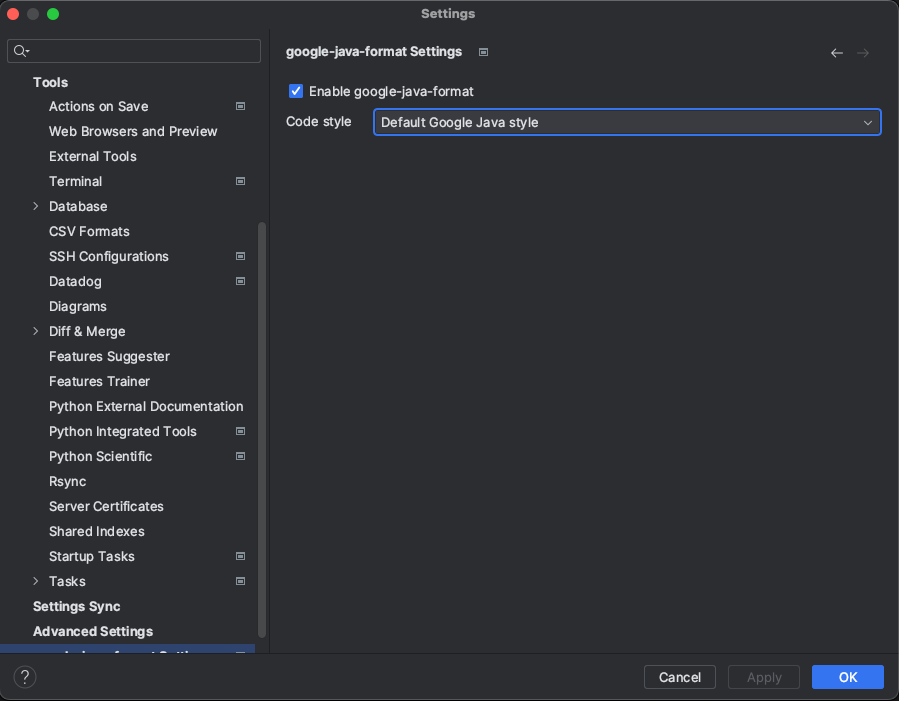

# Contribute

The instructions below help you to contribute to the rosie repository and get your contributions accepted.

## Workflow

1. Update your code in a separate branch
2. Open a PR
3. Make sure all tests pass
4. Get feedback and merge once you have an approval

## Code Hygiene

1. All new code or feature should have a test
2. All tests should pass
3. New code should comply with the coding guidelines (see below)

## Coding Guidelines

The project follows the [Google Java Style Guide](https://google.github.io/styleguide/javaguide.html)
as much as possible. We also recommend you use [IntelliJ](https://www.jetbrains.com/idea/) to contribute to the project (the community version is more than enough).

We highly recommend you use the [google-java-format](https://plugins.jetbrains.com/plugin/8527-google-java-format) IntelliJ plugin. 
Once installed, make sure the plugin is enabled for the project as shown below.




## How to ...

### run all tests


```bash
./gradlew test
```

### Run a single test

```bash
./gradlew test --tests io.codiga.server.e2e.ping.PingTest
```

### ANTLR

**Warning**: ANTLR is being deprecated for [Tree-Sitter](https://tree-sitter.github.io/tree-sitter/). Do not use ANTLR unless strongly necessary. 

#### Generate ASTs

##### JavaScript

```bash
antlr4 -o gen -no-listener -visitor -package io.codiga.parser.javascript.gen JavaScriptLexer.g4 JavaScriptParser.g4
```

Make sure you copy the `Java/*` file with the `.g4` file

##### TypeScript

```bash
antlr4 -o gen -no-listener -visitor -package io.codiga.parser.typescript.gen TypeScriptLexer.g4 TypeScriptParser.g4
```

```bash
javac *.java
```

#### Visualize a file

```bash
grun Python root <python-file> -gui
```

#### Run the CLI version

```bash
./gradlew cli:run --args='--debug true --directory /Users/julien/git/ci-backend-executor/backend_lib/ --output /tmp/bla.json --rules /Users/julien/git/rosie/cli/src/test/resources/20rules.json'
```

#### Custom span tracer in datadog

https://docs.datadoghq.com/tracing/trace_collection/custom_instrumentation/java/


## Important Reading

 * [Tree Sitter - Using Parsers](https://tree-sitter.github.io/tree-sitter/using-parsers)
 * 
