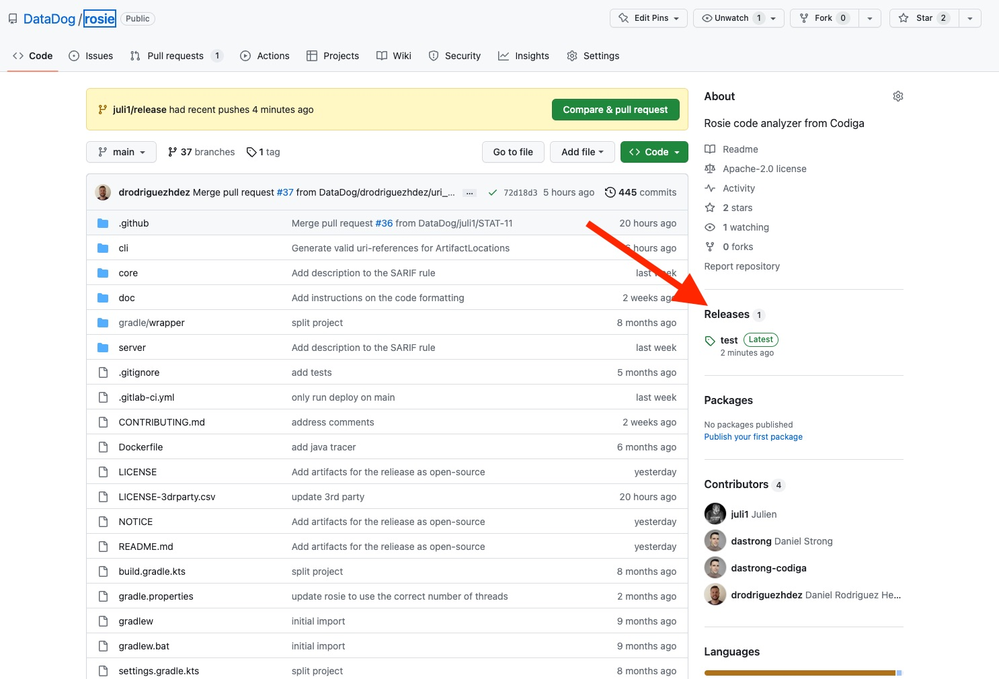
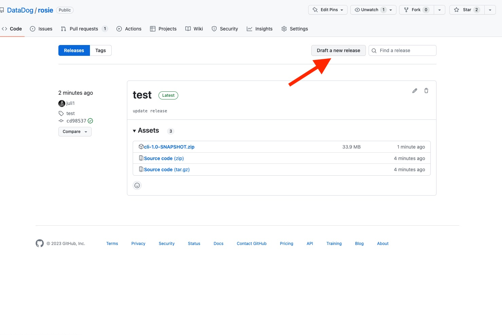
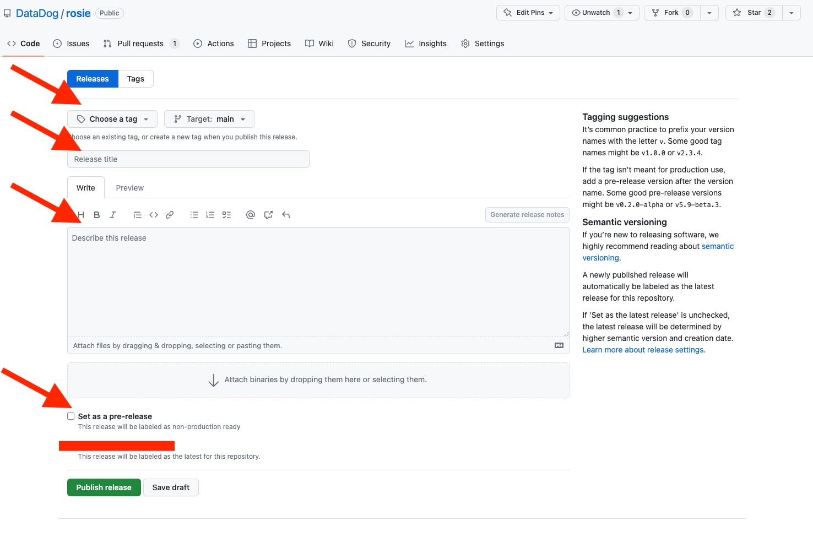
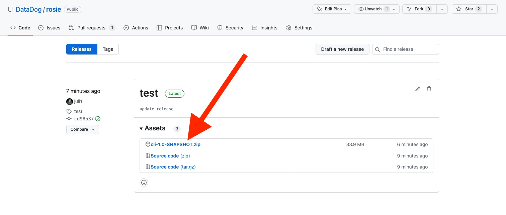
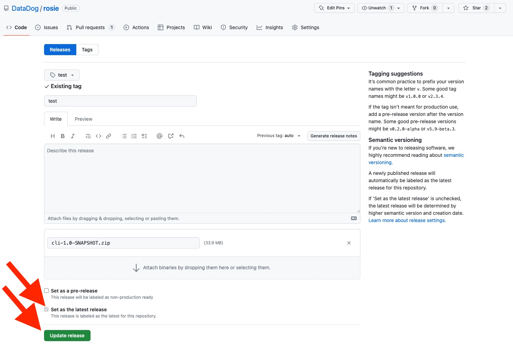

# rosie

Rosie code analyzer from Datadog.


## Release new version

### Step 1: create a new release

Go on the project page and click on the Releases page.




Click on `Draft a new release`





1. Set a version tag that follows `vX.Y`
2. Branch **MUST BE** `main`
3. Put a title and a description




### Step 2: once built, put the release as latest

Check the [GitHub action](https://github.com/DataDog/rosie/actions): it will build a package for your release. 




Once the package is available, change the release to "Latest release"




## Install tree-sitter

This repository relies on tree-sitter and we developed a JNI interface to use tree-sitter in Java.

In the [java-tree-sitter](https://github.com/juli1/java-tree-sitter) project (once cloned), issue the following
command:

```bash
./build.py -o libjava-tree-sitter <path-to-tree-sitter-python>
```

Make sure all submodules are up-to-date. Tree-sitter for java-tree-sitter (the `tree-sitter` directory)
and the version for the Python grammars must be the same (or the python grammar be less than the `tree-sitter`
directory).

To update the submodules: `git submodule update --init --recursive` (first time)
and `git submodule update --recursive --remote`

## Run


### CLI

```bash
./gradlew cli:run --args="--directory /Users/julien/git/ci-backend-executor/backend_lib/ -t true -r rules.json -o plop.json"
```


### Server

```bash
./gradlew server:bootRun
```
